<p align="center"></p>

<p align="center"><a href="README.md">🇬🇧 English</a> · <a href="README.it.md">🇮🇹 Italiano</a></p>

<p align="center">
  
  
  
  
</p>

> [!IMPORTANT]
> Questo repository è un fork di [AlexandreRouma/SDRPlusPlus](https://github.com/AlexandreRouma/SDRPlusPlus). Mantiene la base e la licenza del progetto originale e include modifiche mirate al supporto hardware RFNM utilizzato da [`Rfnm-sdrpp-setup`](https://github.com/chiaraberti13/Rfnm-sdrpp-setup).

<p align="center"><a href="SECURITY.md">Sicurezza</a> · <a href="license">Licenza upstream</a> · <a href="contributing.md">Contribuire</a></p>

---

# 📡 SDR++, il software SDR senza fronzoli

<p align="center">
  <a href="README.md">🇬🇧 English</a> | <a href="README-IT.md">🇮🇹 Italiano</a>
</p>

<p align="center">
  
</p>

SDR++ è un software SDR multipiattaforma e open source, con l'obiettivo di essere
leggero e semplice da usare.

<p align="center">
  
  <a href="https://github.com/chiaraberti13/SDRPlusPlus/stargazers"></a>
  <a href="https://github.com/chiaraberti13/SDRPlusPlus/network/members"></a>
  <a href="https://github.com/chiaraberti13/SDRPlusPlus/issues"></a>
  <a href="license"></a>
</p>

<p align="center">
  <b>Se trovi utile questo progetto, considera di supportarlo:</b><br><br>
  <a href="https://patreon.com/ryzerth"></a>
</p>

<p align="center">
  <a href="https://patreon.com/ryzerth">Patreon</a> ·
  <a href="https://discord.gg/aFgWjyD">Server Discord</a> ·
  <a href="https://www.reddit.com/r/sdrpp/">Reddit</a>
</p>

> IRC: `#sdrpp` ([libera.chat](https://libera.chat)) — **non più attivo, unisciti a Discord invece.**

---

## Indice rapido

- **[Funzionalità](#funzionalità)** — Cosa offre SDR++ appena installato.
- **[Installazione](#installazione)** — Build nightly e installer per Windows, Linux,
  MacOS e BSD.
- **[Compilazione dal sorgente](#compilare-su-windows)** — Istruzioni passo-passo per
  [Windows](#compilare-su-windows), [Linux / BSD](#compilare-su-linux--bsd) e
  [MacOS](#compilare-su-macos).
- **[Elenco moduli](#elenco-moduli)** — Ogni source, sink, decoder e modulo misc, le sue
  dipendenze e se è compilato/abilitato di default.
- **[Risoluzione problemi](#risoluzione-problemi)** — Soluzioni ai problemi più comuni.
- **[Contribuire](#contribuire)** — Come contribuire con band plan e dove segnalare bug.
- **[Crediti](#crediti)** — Patron, contributori e librerie utilizzate.

---

## Cos'è

SDR++ è un **software SDR open source e multipiattaforma** costruito attorno a un solo
obiettivo: restare leggero pur supportando un'ampia gamma di hardware. Ha un **design
modulare**, quindi gran parte delle sue funzionalità — source, sink, decoder — viene
distribuita come plugin, che puoi abilitare, disabilitare o scrivere tu stesso.

## Funzionalità

- Multi VFO
- Ampio supporto hardware (sia tramite SoapySDR sia tramite moduli dedicati)
- DSP accelerato con SIMD
- Multipiattaforma (Windows, Linux, MacOS e BSD)
- Aggiornamento completo del waterfall quando possibile, per rendere la navigazione tra
  i segnali più semplice e piacevole
- Design modulare (scrivi facilmente i tuoi plugin)

## Installazione

### Build Nightly

Le build nightly contengono le funzionalità e le correzioni più recenti. Sono
solitamente stabili quanto le [release
normali](https://github.com/AlexandreRouma/SDRPlusPlus/releases), ma sono disponibili
nel giro di pochi minuti o ore dal push di una modifica al codice.

Puoi scaricarle [qui](https://www.sdrpp.org/nightly). Il link ti reindirizzerà
all'ultima nightly su GitHub: scorri fino ad "Artifacts" e clicca sulla versione per il
tuo sistema operativo.

Al momento GitHub richiede un account per poter scaricare i file, quindi assicurati di
aver effettuato l'accesso.

### Windows

Scarica l'ultima release dalla [pagina delle
Release](https://github.com/AlexandreRouma/SDRPlusPlus/releases) ed estraila nella
cartella che preferisci.

Per creare un collegamento sul desktop, fai clic destro sull'exe e seleziona `Invia a ->
Desktop (crea collegamento)`, poi rinomina il collegamento sul desktop come preferisci.

### Linux

#### Basate su Debian (Ubuntu, Mint, ecc.)

**Attenzione: NON** usare il pacchetto `sdrpp` del gestore pacchetti. Il pacchetto è
incompleto e incompatibile con tutti i moduli ufficiali e out-of-tree.

Scarica l'ultima release dalla [pagina delle
Release](https://github.com/AlexandreRouma/SDRPlusPlus/releases) ed estraila nella
cartella che preferisci.

Poi usa apt per installarlo:

```sh
sudo apt install path/to/the/sdrpp_debian_amd64.deb
```

**IMPORTANTE: devi installare i driver per il tuo SDR. Segui le istruzioni del produttore
su come farlo sulla tua distro.**

#### Basate su Arch

Installa dal sorgente seguendo le istruzioni qui sotto.

**ATTENZIONE: il pacchetto AUR sdrpp-git non è più ufficiale, se ne sconsiglia l'uso.**

#### Altre distribuzioni

Al momento non esistono pacchetti per altre distribuzioni; per questi sistemi dovrai
[compilare dal sorgente](#compilare-su-linux--bsd).

### MacOS

Scarica il bundle dell'app dall'ultima [build
nightly](https://www.sdrpp.org/nightly).

### BSD

Al momento non esistono pacchetti per BSD, fai riferimento a [Compilare su Linux /
BSD](#compilare-su-linux--bsd) per le istruzioni su come compilare dal sorgente.

## Compilare su Windows

L'IDE consigliato è [VS Code](https://code.visualstudio.com/), per avere un'esperienza
di sviluppo simile su tutte le piattaforme e per compilare con CMake da riga di comando.

### Installa le dipendenze

- [cmake](https://cmake.org)
- [vcpkg](https://vcpkg.io)
- [PothosSDR](https://github.com/pothosware/PothosSDR) (installa le librerie per la
  maggior parte degli SDR. Va installato in `C:/Program Files/PothosSDR`)
- [RtAudio](https://www.music.mcgill.ca/~gary/rtaudio/) (va compilato e installato in
  `C:/Program Files (x86)/RtAudio/`)

Dopodiché, installa le seguenti dipendenze con vcpkg:

- fftw3
- glfw3
- zstd

Probabilmente compilerai a 64 bit, quindi assicurati che vcpkg installi le versioni
corrette usando `.\vcpkg.exe install <package>:x64-windows`

### Compilare da riga di comando

**IMPORTANTE:** sostituisci `<vcpkg install directory>` con la cartella di installazione
di vcpkg.

```
mkdir build
cd build
cmake .. "-DCMAKE_TOOLCHAIN_FILE=<vcpkg install directory>/scripts/buildsystems/vcpkg.cmake" -G "Visual Studio 16 2019"
cmake --build . --config Release
```

### Eseguire in modalità sviluppo

#### Crea una nuova cartella di configurazione root

```bat
./create_root.bat
```

Questo creerà la cartella `root_dev`, usata per salvare le configurazioni di sdrpp e dei
moduli.

Dovrai poi modificare il file `root_dev/config.json` per farlo puntare ai moduli
compilati. Se il file manca nella tua cartella, esegui l'applicazione una volta e ne
creerà uno con valori di default — vedi più avanti come eseguire l'applicazione.

#### Esegui SDR++ da riga di comando

Dalla cartella principale, puoi semplicemente eseguire:

```bat
./build/Release/sdrpp.exe -r root_dev -c
```

Oppure, se vuoi eseguirlo dalla cartella di build, es. `build/Release`, adatta il
percorso relativo alla cartella `root_dev`:

```bat
./sdrpp.exe -r ../../root_dev -c
```

L'argomento opzionale `-c` serve a mantenere la console attiva per vedere i messaggi di
errore.

Poiché tutti i percorsi sono relativi, per il resto delle istruzioni da riga di comando
assumiamo che tu stia eseguendo dalla cartella principale usando il comando precedente.
Come accennato prima, devi modificare `root_dev/config.json` per aggiungere i moduli
compilati. Nel file di configurazione predefinito devi aggiungere i percorsi nella
sezione `modules`. Aggiungi a questo elenco tutti i moduli che vuoi usare.

```json
...
"modules": [
    "./build/radio/Release/radio.dll",
    "./build/recorder/Release/recorder.dll",
    "./build/rtl_tcp_source/Release/rtl_tcp_source.dll",
    "./build/audio_sink/Release/audio_sink.dll"
]
...
```

Devi anche cambiare la posizione delle cartelle di risorse e moduli; per lo sviluppo,
consiglio:

```json
...
"modulesDirectory": "root_dev/modules",
...
"resourcesDirectory": "root_dev/res",
...
```

Ricorda che questi percorsi saranno relativi alla cartella di esecuzione.

### Installare SDR++

Se scegli di eseguire SDR++ in modalità sviluppo, non serve questo passaggio.
Prima di tutto, copia l'exe e le DLL da `build/Release/` a `root_dev`.

Poi devi copiare tutti i moduli compilati. Per farlo, copia il file DLL del modulo
(situato nella sua cartella di build indicata di seguito) nella cartella
`root_dev/modules`, e le altre DLL (che non hanno il nome esatto del modulo) nella
cartella `root_dev`.

I moduli compilati saranno alcuni tra i seguenti (ripeti le istruzioni sopra per tutti
quelli che vuoi usare):

- `build/radio/Release/`
- `build/recorder/Release/`
- `build/rtl_tcp_source/Release/`
- `build/spyserver_source/Release/`
- `build/airspyhf_source/Release/`
- `build/plutosdr_source/Release/`
- `build/audio_sink/Release/`

## Compilare su Linux / BSD

### Scegli quali moduli compilare

A seconda del modulo che vuoi compilare, dovrai installare alcune dipendenze
aggiuntive. Fai riferimento all'[elenco moduli](#elenco-moduli) più avanti in questo
readme per nomi, dipendenze e opzioni di build di ciascun modulo.

Le opzioni di build vengono poi passate al comando cmake così: `cmake ..
-DOPTION_NAME_HERE=ON -DANOTHER_OPTION_HERE=OFF` ecc...

### Installa le dipendenze

- cmake
- fftw3
- glfw
- libvolk
- zstd

Poi installa le dipendenze in base ai moduli che vuoi compilare (vedi il passo
precedente).

Nota: assicurati di usare GCC 8 o successivo, poiché le versioni più vecchie non hanno
`std::filesystem` integrato.

### Compilazione

Sostituisci `<N>` con il numero di thread che vuoi usare per la compilazione.

```sh
mkdir build
cd build
cmake ..
make -j<N>
```

### Crea una nuova cartella root

```sh
sh ./create_root.sh
```

### Eseguire in modalità sviluppo

Se vuoi installare SDR++, salta al passo successivo.

Prima esegui SDR++ dalla cartella di build per generare un file di configurazione
predefinito:

```
./sdrpp -r ../root_dev/
```

Poi dovrai modificare il file `root_dev/config.json` per farlo puntare ai moduli
compilati. Ecco un esempio di come dovrebbe apparire:

```json
...
"modules": [
    "./build/radio/radio.so",
    "./build/recorder/recorder.so",
    "./build/rtl_tcp_source/rtl_tcp_source.so",
    "./build/audio_sink/audio_sink.so"
]
...
```

Nota: puoi generare questo elenco automaticamente eseguendo `find . | grep '\.so' | sed
's/^/"/' | sed 's/$/",/' | sed '/sdrpp_core.so/d'` nella cartella di build.

Devi anche cambiare la posizione delle cartelle di risorse e moduli; per lo sviluppo,
consiglio:

```json
...
"modulesDirectory": "./root_dev/modules",
...
"resourcesDirectory": "./root_dev/res",
...
```

Ricorda che questi percorsi saranno relativi alla cartella di esecuzione.

Naturalmente, ricordati di aggiungere le voci per tutti i moduli che hai compilato e che
vuoi usare.

Poi, dalla cartella principale, puoi semplicemente eseguire:

```
./build/sdrpp -r root_dev
```

Oppure, se vuoi eseguirlo dalla cartella di build, dovrai correggere i percorsi nel file
config.json, e poi eseguire:

```
./sdrpp -r ../root_dev
```

### Installare SDR++

Per installare SDR++, esegui il seguente comando nella cartella `build`:

```sh
sudo make install
```

## Compilare su MacOS

Attenzione: non è per i deboli di cuore e le istruzioni sono per lo più non testate. Si
consiglia di usare le [build nightly](https://www.sdrpp.org/nightly) al loro posto.

### Installa le dipendenze

Le dipendenze sono esattamente le stesse di Linux: fai riferimento a quella sezione per
le dipendenze principali e all'[elenco moduli](#elenco-moduli) per quelle specifiche di
ogni modulo. Dovrai installare le dipendenze con Homebrew.

Assicurati di installare portaudio, perché servirà più avanti.

Un esempio di comando di installazione:

```sh
brew install libusb fftw glfw airspy airspyhf portaudio hackrf rtl-sdr libbladerf codec2 zstd volk
pip3 install mako
```

### Compilazione

Servono alcuni argomenti cmake particolari in più rispetto a quelli di Linux. Dovrai
abilitare i moduli sink di portaudio `-DOPT_BUILD_PORTAUDIO_SINK=ON
-DOPT_BUILD_NEW_PORTAUDIO_SINK=ON` e disabilitare il solito sink rtaudio
`-DOPT_BUILD_AUDIO_SINK=OFF`, oltre all'opzione per dire a SDR++ che verrà eseguito come
bundle MacOS `-DUSE_BUNDLE_DEFAULTS=ON`. Su versioni di MacOS precedenti a Catalina
(10.15), dovrai anche usare lo std::filesystem interno, poiché il sistema operativo non
lo fornisce `-DOPT_OVERRIDE_STD_FILESYSTEM=ON`.

Ecco un esempio di comandi di build che compilano quasi tutti i moduli al momento della
stesura. Puoi sempre controllare gli script di CI per gli argomenti più aggiornati, ma
questo dovrebbe funzionare. Dalla cartella principale di SDRPlusPlus:

```sh
mkdir build
cd build
cmake .. -DOPT_BUILD_SOAPY_SOURCE=OFF -DOPT_BUILD_BLADERF_SOURCE=ON -DOPT_BUILD_AUDIO_SOURCE=OFF -DOPT_BUILD_AUDIO_SINK=OFF -DOPT_BUILD_PORTAUDIO_SINK=ON -DOPT_BUILD_NEW_PORTAUDIO_SINK=ON -DOPT_BUILD_M17_DECODER=ON -DUSE_BUNDLE_DEFAULTS=ON -DCMAKE_BUILD_TYPE=Release
make -j<N>
```

### Crea il bundle e installa

Dalla cartella principale di SDRPlusPlus:

```sh
sh make_macos_bundle.sh ./build ./SDR++.app
```

Questo creerà un bundle `SDR++.app` che puoi installare come qualsiasi altra app MacOS
trascinandolo in Applicazioni.

## Elenco moduli

Non tutti i moduli sono compilati di default. I moduli con librerie voluminose,
librerie non installabili tramite il gestore pacchetti (o Pothos) e quelli ancora in
beta sono disabilitati di default. I moduli in beta sono comunque inclusi nelle release
per la maggior parte, ma non abilitati in SDR++ (vanno istanziati).

### Source

| Nome                 | Stato       | Dipendenze         | Opzione                        | Compilato di default | Compilato in Release    | Abilitato in SDR++ di default |
|----------------------|-------------|--------------------|---------------------------------|:---------------------:|:------------------------:|:-------------------------------:|
| airspy_source        | Funzionante | libairspy          | OPT_BUILD_AIRSPY_SOURCE        | ✅                    | ✅                       | ✅                              |
| airspyhf_source      | Funzionante | libairspyhf        | OPT_BUILD_AIRSPYHF_SOURCE      | ✅                    | ✅                       | ✅                              |
| audio_source         | Funzionante | rtaudio            | OPT_BUILD_AUDIO_SOURCE         | ✅                    | ✅                       | ✅                              |
| bladerf_source       | Funzionante | libbladeRF         | OPT_BUILD_BLADERF_SOURCE       | ⛔                    | ✅ (non su Debian Buster)| ✅                              |
| file_source          | Funzionante | -                  | OPT_BUILD_FILE_SOURCE          | ✅                    | ✅                       | ✅                              |
| fobossdr_source      | Funzionante | libfobos           | OPT_BUILD_FOBOSSDR_SOURCE      | ✅                    | ✅                       | ✅                              |
| hackrf_source        | Funzionante | libhackrf          | OPT_BUILD_HACKRF_SOURCE        | ✅                    | ✅                       | ✅                              |
| harogic_source       | Beta        | htra_api           | OPT_BUILD_HAROGIC_SOURCE       | ⛔                    | ⛔                       | ✅                              |
| hermes_source        | Beta        | -                  | OPT_BUILD_HERMES_SOURCE        | ✅                    | ✅                       | ✅                              |
| kcsdr_source         | Incompleto  | libkcsdr           | OPT_BUILD_KCSDR_SOURCE         | ⛔                    | ⛔                       | ⛔                              |
| limesdr_source       | Funzionante | liblimesuite       | OPT_BUILD_LIMESDR_SOURCE       | ⛔                    | ✅                       | ✅                              |
| network_source       | Beta        | -                  | OPT_BUILD_NETWORK_SOURCE       | ✅                    | ✅                       | ✅                              |
| perseus_source       | Beta        | libperseus-sdr     | OPT_BUILD_PERSEUS_SOURCE       | ⛔                    | ✅                       | ✅                              |
| plutosdr_source      | Funzionante | libiio, libad9361  | OPT_BUILD_PLUTOSDR_SOURCE      | ✅                    | ✅                       | ✅                              |
| rfnm_source          | Beta        | librfnm            | OPT_BUILD_RFNM_SOURCE          | ⛔                    | ✅                       | ✅                              |
| rfspace_source       | Funzionante | -                  | OPT_BUILD_RFSPACE_SOURCE       | ✅                    | ✅                       | ✅                              |
| rtl_sdr_source       | Funzionante | librtlsdr          | OPT_BUILD_RTL_SDR_SOURCE       | ✅                    | ✅                       | ✅                              |
| rtl_tcp_source       | Funzionante | -                  | OPT_BUILD_RTL_TCP_SOURCE       | ✅                    | ✅                       | ✅                              |
| sdrplay_source       | Funzionante | SDRplay API        | OPT_BUILD_SDRPLAY_SOURCE       | ⛔                    | ✅                       | ✅                              |
| sdrpp_server_source  | Funzionante | -                  | OPT_BUILD_SDRPP_SERVER_SOURCE  | ✅                    | ✅                       | ✅                              |
| soapy_source         | Deprecato   | soapysdr           | OPT_BUILD_SOAPY_SOURCE         | ⛔                    | ⛔                       | ⛔                              |
| spectran_source      | Incompleto  | RTSA Suite         | OPT_BUILD_SPECTRAN_SOURCE      | ⛔                    | ⛔                       | ⛔                              |
| spectran_http_source | Beta        | -                  | OPT_BUILD_SPECTRAN_HTTP_SOURCE | ✅                    | ✅                       | ✅                              |
| spyserver_source     | Funzionante | -                  | OPT_BUILD_SPYSERVER_SOURCE     | ✅                    | ✅                       | ✅                              |
| usrp_source          | Beta        | libuhd             | OPT_BUILD_USRP_SOURCE          | ⛔                    | ⛔                       | ✅                              |

### Sink

| Nome               | Stato       | Dipendenze | Opzione                       | Compilato di default | Compilato in Release | Abilitato in SDR++ di default |
|--------------------|-------------|------------|---------------------------------|:---------------------:|:----------------------:|:-------------------------------:|
| android_audio_sink | Funzionante | -          | OPT_BUILD_ANDROID_AUDIO_SINK   | ⛔                    | ✅                     | ✅ (solo Android)               |
| audio_sink         | Funzionante | rtaudio    | OPT_BUILD_AUDIO_SINK           | ✅                    | ✅                     | ✅                              |
| network_sink       | Funzionante | -          | OPT_BUILD_NETWORK_SINK         | ✅                    | ✅                     | ✅                              |
| new_portaudio_sink | Funzionante | portaudio  | OPT_BUILD_NEW_PORTAUDIO_SINK   | ⛔                    | ✅                     | ⛔                              |
| portaudio_sink     | Funzionante | portaudio  | OPT_BUILD_PORTAUDIO_SINK       | ⛔                    | ✅                     | ⛔                              |

### Decoder

| Nome                 | Stato       | Dipendenze | Opzione                        | Compilato di default | Compilato in Release | Abilitato in SDR++ di default |
|----------------------|-------------|------------|----------------------------------|:---------------------:|:----------------------:|:-------------------------------:|
| atv_decoder          | Incompleto  | -          | OPT_BUILD_ATV_DECODER          | ⛔                    | ⛔                     | ⛔                              |
| dab_decoder          | Incompleto  | -          | OPT_BUILD_DAB_DECODER          | ⛔                    | ⛔                     | ⛔                              |
| falcon9_decoder      | Incompleto  | ffplay     | OPT_BUILD_FALCON9_DECODER      | ⛔                    | ⛔                     | ⛔                              |
| kgsstv_decoder       | Incompleto  | -          | OPT_BUILD_KGSSTV_DECODER       | ⛔                    | ⛔                     | ⛔                              |
| m17_decoder          | Funzionante | -          | OPT_BUILD_M17_DECODER          | ⛔                    | ✅                     | ⛔                              |
| meteor_demodulator   | Funzionante | -          | OPT_BUILD_METEOR_DEMODULATOR   | ✅                    | ✅                     | ⛔                              |
| pager_decoder        | Incompleto  | -          | OPT_BUILD_PAGER_DECODER        | ⛔                    | ⛔                     | ⛔                              |
| radio                | Funzionante | -          | OPT_BUILD_RADIO                | ✅                    | ✅                     | ✅                              |
| radio                | Incompleto  | -          | OPT_BUILD_VOR_RECEIVER         | ⛔                    | ⛔                     | ⛔                              |
| weather_sat_decoder  | Incompleto  | -          | OPT_BUILD_WEATHER_SAT_DECODER  | ⛔                    | ⛔                     | ⛔                              |

### Misc

| Nome                 | Stato       | Dipendenze | Opzione                       | Compilato di default | Compilato in Release | Abilitato in SDR++ di default |
|----------------------|-------------|------------|---------------------------------|:---------------------:|:----------------------:|:-------------------------------:|
| discord_integration  | Funzionante | -          | OPT_BUILD_DISCORD_PRESENCE    | ✅                    | ✅                     | ⛔                              |
| frequency_manager    | Funzionante | -          | OPT_BUILD_FREQUENCY_MANAGER   | ✅                    | ✅                     | ✅                              |
| iq_exporter          | Funzionante | -          | OPT_BUILD_IQ_EXPORTER         | ✅                    | ✅                     | ⛔                              |
| recorder             | Funzionante | -          | OPT_BUILD_RECORDER            | ✅                    | ✅                     | ✅                              |
| rigctl_client        | Incompleto  | -          | OPT_BUILD_RIGCTL_CLIENT       | ✅                    | ✅                     | ⛔                              |
| rigctl_server        | Funzionante | -          | OPT_BUILD_RIGCTL_SERVER       | ✅                    | ✅                     | ✅                              |
| scanner              | Beta        | -          | OPT_BUILD_SCANNER             | ✅                    | ✅                     | ⛔                              |
| scheduler            | Incompleto  | -          | OPT_BUILD_SCHEDULER           | ⛔                    | ⛔                     | ⛔                              |

## Risoluzione problemi

Prima di tutto, assicurati di usare l'ultima build automatica. Se il tuo problema è
legato a un bug, è probabile che sia già stato corretto nelle release successive.

### SDR++ va in crash e poi non si avvia più, qualunque cosa io faccia

Questo è un bug della 1.0.0, corretto nella 1.0.1.

In alcuni casi, se un crash avveniva mentre la configurazione veniva salvata, il file di
configurazione si corrompeva e SDR++ si rifiutava di avviarsi a causa di questo.

Il problema è stato risolto: se un file di configurazione è corrotto, verrà semplicemente
ripristinato allo stato predefinito.

### Errore "hash collision" all'avvio

Probabilmente hai installato il pacchetto `soapysdr-module-all` su Ubuntu/Debian. In caso
contrario, si tratta comunque di un bug di SoapySDR causato dal conflitto tra più moduli
soapy. Disinstalla tutto ciò che è collegato a SoapySDR, poi installa soapysdr stesso e
solo i moduli soapy di cui hai effettivamente bisogno.

### "Non vedo -nome del modulo qui-, cosa succede?"

Se il modulo è stato incluso in un aggiornamento successivo, non è abilitato nella
configurazione. Il modo più semplice per risolvere è eliminare il file `config.json` e
lasciare che SDR++ lo ricrei (perderai le impostazioni relative all'interfaccia
principale, come i colori dei VFO, il livello di zoom e il tema). L'opzione migliore è
però modificare il file di configurazione per aggiungere un'istanza del modulo che vuoi
abilitare (vedi l'[elenco moduli](#elenco-moduli)).

### SDR++ va in crash quando si ferma un RTL-SDR

Questo è un bug introdotto di recente da libusb1.4. Per risolverlo, esegui il downgrade
a libusb1.3.

### SDR++ va in crash quando si avvia un HackRF

Se hai anche il modulo SoapySDR abilitato, si tratta di un bug in libhackrf, causato dal
fatto che libhackrf non controlla se è già stato inizializzato. La soluzione, fino al
rilascio di una versione corretta di libhackrf, è disabilitare il modulo soapy_source da
SDR++. Per farlo, vai nel menu "Module Manager" e clicca sul pulsante `-` accanto alla
riga con "soapy_source". Dopodiché, riavvia SDR++.

### Problema non elencato qui?

Se hai ancora un problema, apri una issue oppure chiedi su Discord.

## Contribuire

Sentiti libero di proporre band plan tramite il tracker delle issue su GitHub.
Per modifiche al codice, apri invece una feature request.

## Crediti

### Patron

- Bob Logan
- [Christian Häusler](https://github.com/corvus-ch)
- Croccydile
- Dale L Puckett (K0HYD)
- [Daniele D'Agnelli](https://linkedin.com/in/dagnelli)
- [David Taylor (GM8ARV)](https://twitter.com/gm8arv)
- D. Jones
- Dexruus
- [EB3FRN](https://www.eb3frn.net/)
- Eric Johnson
- Ernest Murphy (NH7L)
- Flinger Films
- [Frank Werner (HB9FXQ)](https://twitter.com/HB9FXQ)
- gringogrigio
- Jandro
- Jeff Moe
- Joe Cupano
- KD1SQ
- Kezza
- Krys Kamieniecki
- Lee Donaghy
- Lee (KD1SQ)
- .lozenge. (Hank Hill)
- Martin Herren (HB9FXX)
- NeoVilsonWong
- Nitin (VU2JEK)
- ON4MU
- [Passion-Radio.com](https://passion-radio.com/)
- Paul Maine
- Peter Betz
- [Scanner School](https://scannerschool.com/)
- Scott Palmer
- [SignalsEverywhere](https://signalseverywhere.com/)
- Syne Ardwin (WI9SYN)
- [W4IPA](https://twitter.com/W4IPAstroke5)
- William Arcand (W1WRA)
- William Pitchford
- [Yves Rougy](https://www.twitch.tv/yorzian)
- [Zipper](https://github.com/reppiZ)

### Contributori

- [Aang23](https://github.com/Aang23)
- [Alexsey Shestacov](https://github.com/wingrime)
- [Aosync](https://github.com/aosync)
- [Benjamin Kyd](https://github.com/benkyd)
- [Benjamin Vernoux](https://github.com/bvernoux)
- [Cropinghigh](https://github.com/cropinghigh)
- [Fred F4EED](http://f4eed.wordpress.com/)
- [Howard0su](https://github.com/howard0su)
- John Donkersley
- [Joshua Kimsey](https://github.com/JoshuaKimsey)
- [Manawyrm](https://github.com/Manawyrm)
- [Martin Hauke](https://github.com/mnhauke)
- [Marvin Sinister](https://github.com/marvin-sinister)
- [Maxime Biette](https://github.com/mbiette)
- [Paulo Matias](https://github.com/thotypous)
- [Raov](https://twitter.com/raov_birbtog)
- [Cam K.](https://github.com/Starman0620)
- [Shuyuan Liu](https://github.com/shuyuan-liu)
- [Syne Ardwin (WI9SYN)](https://esaille.me/)
- [Szymon Zakrent](https://github.com/zakrent)
- Youssef Touil
- [Zimm](https://github.com/invader-zimm)

### Librerie utilizzate

- [SoapySDR (PothosWare)](https://github.com/pothosware/SoapySDR)
- [Dear ImGui (ocornut)](https://github.com/ocornut/imgui)
- [json (nlohmann)](https://github.com/nlohmann/json)
- [rtaudio](http://www.portaudio.com/)
- [Portable File Dialogs](https://github.com/samhocevar/portable-file-dialogs)

---

<p align="center">
  <sub>Creato originariamente da <a href="https://github.com/AlexandreRouma">Alexandre Rouma</a> · Questo fork è mantenuto da <a href="https://github.com/chiaraberti13">chiaraberti13</a></sub>
</p>
